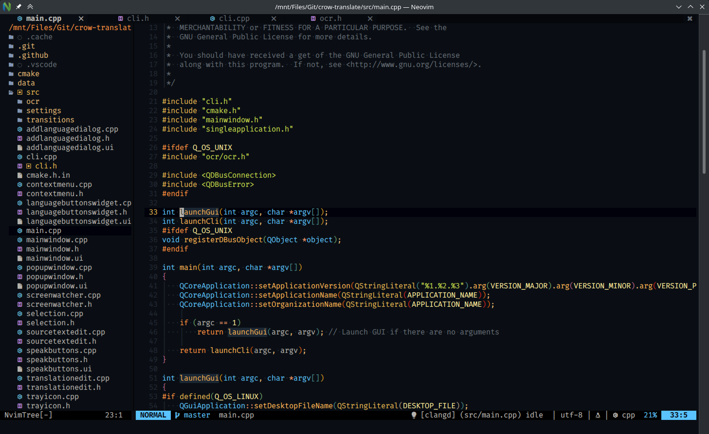

# Neovim Ayu

A colorscheme for Neovim reimplemented in lua from [ayu-vim](https://github.com/Luxed/ayu-vim).

## Screenshots




## Commands

To apply the colorscheme, you can call `require('ayu').colorscheme()` from lua or use `:colorscheme ayu` command. By default it respect your `background` (see `:h background`) setting to choose between `dark` and `light` variants. But you can use `:colorscheme ayu-<dark,light,mirage>]` commands to apply a variant directly.

## Configuration

To configure the plugin, you can call `require('ayu').setup(values)`, where `values` is a dictionary with the parameters you want to override. Here are the defaults:

```lua
require('ayu').setup({
    mirage = false, -- Set to `true` to use `mirage` variant instead of `dark` for dark background.
    overrides = {}, -- A dictionary with a group names associated with a dictionary with parameters (`bg`, `fg`, `sp` and `style`) and colors in hex.
})
```

### Overrides example

Replace `IncSearch` highlight with foreground set to `#FFFFFF`:

```lua
require('ayu').setup({
  overrides = {
    IncSearch = {fg = '#FFFFFF'}
  }
})
```

To get the colors from the colorscheme you can use `ayu.colors`. Example:

```lua
local colors = require('ayu.colors')

require('ayu').setup({
  overrides = {
    IncSearch = {fg = colors.fg}
  }
})
```

Use `:lua print(vim.inspect(require('ayu.colors')))` command to check all available colors.
